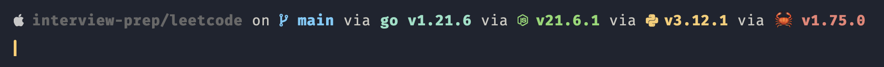

# Dotfiles!

What follows are my personal dotfiles, MacOS setup recommendations, software, and settings
for general software development.

## A note on my recommendations

Consider which philosophy you prefer. Would you rather:

- Always find and use the best tool for the job, at the cost of potentially having to
  learn a lot more tools
- Find and use good multi-purpose tools, at the cost of not necessarily using the best
  tool for a given job

I tend to fall into the second camp, personally. Thus, the things I use and recommend to
others tend to be things that are more broadly applicable and unspecialized, with
exceptions which I will note.

So if you see my recommendation for something and wonder "Why not X?", it's possible X is
a more specialized tool, which might excel at its specialization but incur the additional
overhead of learning and interfacing with it. But if you already know X, by all means
stick with it! My other personal philosophy is that the best tool for the job is the one
you are already most familiar with. 🙂

#### Kelli's TODO
- [ ] Finish README ;)
- [x] Merge no-oh-my-zsh branch and clean up MacBook Air instance
- [x] Decide if I want a Brewfile
- [ ] Standardize asdf installs across machines
- [ ] Catalogue VSCode extension + settings recs
- [x] Catalogue MacOS software recs
- [ ] Maybe set up and add instructions for using [stow](https://github.com/aspiers/stow)

## General advice

- Unify how you install software packages, for example with Homebrew. It can get very
  annoying to manage dependencies and versions if some of them are managed by Homebrew,
  some of them are one-off installed with special installers, some of them are manually
  cloned and built from the source, etc. If nothing else, try to never end up with
  multiple installation methods for the same software executables! They'll fight over your
  PATH variable and make everything more confusing than it needs to be. If your package
  manager supports any sort of dependency declaration file that you can check in with your
  personal dotfiles (e.g. Brewfile via
  [homebrew-file](https://github.com/rcmdnk/homebrew-file) or
  [homebrew-bundle](https://github.com/Homebrew/homebrew-bundle)), all the better!

## Software I use

### Primary software

#### Editor: [VS Code](https://code.visualstudio.com/)

Does it have the most fully-featured, rich language integration for a given language? No,
of course not. But does it have an LSP and pretty good support for *every* language? Yes,
that it does. It's highly customizable, and its extensions marketplace is frankly
unrivaled and unlikely to be for a very long time. Since extensions are written with
ubiquitous web technologies like JavaScript and CSS, there's a very low barrier to entry
for developers who use VS Code to write and maintain them compared to other editors. Does
that make VS Code slower than other editors? Yes, absolutely. But for me personally, when
I probably spend just as much time outside of my editor as I spend in it, the efficiency
gains I get from specific extensions likely near cancel out the efficiency cost of a
slightly less performant editing experience.

#### Note taking: [Notion](https://www.notion.so/)

WIP.

#### Web browser: [Arc](https://arc.net/)

While I'm not convinced Arc is the be-all-end-all of web browsers, it's certainly doing
some things right to make web browsing a more pleasant experience again. It's jam packed
with attention to detail and lots of little things: a refreshing and fun UI, smart new tab
organizational strategies, built-in ad block, built-in tab sleeping for memory management,
tab auto-archiving, a global command bar, per-website "boosts", and even floating video
players (including for video calls). It's Chromium-based, so it still works with all your
favorite Chromium extensions, but the UI was also built with Swift for nearly native UI
performance. It even has some pretty tasteful AI integration, in my opinion, including
quick previews when hovering links, tab and download auto-renaming, and instant open from
search.

#### Terminal: [Warp](https://www.warp.dev/)

For years I would always "just use iTerm2". It's clear iTerm2 is a mature, tried-and-true,
general-purpose replacement for the default MacOS terminal that fills in a couple of its
basic missing features like split pane, search term highlighting, and terminal
customizability. However, lately I’ve been trying out Warp, which brings more of a native
IDE-like experience to the terminal in a way that I quite enjoy. It's not perfect (for
example, it's unfortunately closed source and requires login, which I don't love), but
there's a lot of active development and innovation going on there that I've never before
seen in a terminal. It has things like pinning and bookmarking commands, built-in command
autocomplete for a whole host of popular executables (the only downside is, it's not
versioned or even aware of if you have that executable in your PATH!), ask AI to help
generate a command, and command "intellisense" like in an IDE.

#### DBMS: [TablePlus](https://tableplus.com/)

TablePlus has been my one-stop shop for database inspection and administration for years
now. I've never run into a relational database it couldn't accommodate, and it even works
with many NoSQL databases. The generous free tier, which includes all functionality
indefinitely just with a 2 tab and 2 window limit, is already enough for any of my side
projects, and premium licenses are "buy once, use forever" as opposed to a subscription
model. Its query editor has autocomplete, syntax highlighting, formatting, and favorites +
history.

#### API client: [Hoppscotch](https://hoppscotch.com/download)

While I previously used Insomnia for years, their product has gradually lost favor with a
lot of developers due to how hard they've been pushing their premium subscriptions and
degrading the experience for everyone else, including upsells littering the UI and even a
nasty update in the past that wiped everyone's data locally who wasn't using their cloud
syncing. That's when I found Hoppscotch, which was newer but somehow even more
feature-rich. It's open source, has native support for GraphQL and realtime (websocket,
SSE, MQTT) APIs, keeps your request history, supports cookies, allows filtering responses
with JSONPath, and can create an entire collection from importing an OpenAPI
specification.

#### LLM chatbot of choice: [GodMode](https://github.com/smol-ai/GodMode)

Why use just one when you could use multiple simultaneously and check them against each
other? Though it has unfortunately not seen many updates recently, this open source
multi-chatbot browser is still the best option I've found for a free, robust, multi-LLM
chat client. Due to its use of webviews, it's not reliant on any API, which means both 1)
it doesn't break when the API changes, and 2) new functionality is available in the app as
soon as its launched on the service, as opposed to having to wait for API support. There's
no paywall at all, and it even has a global keyboard shortcut to easily pull it up from
anywhere on your machine. My current setup uses Google Gemini (formerly Bard), Claude 3,
Perplexity, ChatGPT 3.5, and Inflection Pi (which are all free) in parallel.

### Theme

#### Color theme: [ayu](https://github.com/ayu-theme)

#### Font: [Dank Mono](https://philpl.gumroad.com/l/dank-mono)

#### Prompt: [Starship](https://starship.rs/)

### CLI tools

#### [hub](https://hub.github.com/)

CLI wrapper around git that extends the git CLI with additional commands that make it
easier to work with GitHub. Everything you like about gh, except packaged together with
git as a single tool. I alias `git` to `hub` once and then never even have to remember
it's there.

#### [asdf](https://asdf-vm.com/)

Single runtime and language tool version manager with plugins for almost every language or
runtime tool under the sun. Replaces nvm/n/volta for Node, rvm/rbenv for Ruby, rsvm/rustup
for Rust, gvm/g for Golang, pyenv for Python, jenv/jabba for Java, and lots more like
them.

#### [tldr](https://github.com/tldr-pages/tldr)

Community-driven manual/help pages for popular CLI tools that focus on common operations
with popular options and usage examples. Instead of having to sift through hundreds of
subcommands and flags to remember how to do something basic, which is often the case with
the exhaustive help docs that ship with most CLI tools, tldr offers to complement those
docs with a simpler set focused on practical usage.

### Quality of life

#### [Bitwarden](https://bitwarden.com/)

Open source, cross-platform password manager. Supports 2FA codes, sharing via vaults,
auto-filling, secure password generation, and more.

#### [uBlock](https://ublockorigin.com/)

Open source, performant, ad and content blocker with manual element blocker.

#### [noTunes](https://github.com/tombonez/noTunes)

If you don't use Apple Music and have ever accidentally pressed a media control key when
you didn't have other media playing, only to have Apple Music annoyingly throw itself in
your face, this is the app for you. It's super lightweight: it just prevents Apple Music
from opening if it ever tries to, since Apple doesn’t give you any way of disabling it
natively.

#### [RunCat](https://apps.apple.com/us/app/runcat/id1429033973)

The cutest, most nonintrusive system resource monitor you could ever want! A little sprite
cat sits in your menu bar and runs faster when your system is hard at work. You can view
CPU and memory utilization at a glance by clicking it.

#### [Raycast](https://www.raycast.com/)

Supercharged, drop-in replacement for MacOS Spotlight (cmd+space) with a huge
collection of extensions, a built-in calculator with currency and date/time conversions, a
clipboard history manager, a window tiling manager, an emoji picker with hotkey trigger,
and more.

#### [AltTab](https://alt-tab-macos.netlify.app/)

A better version of cmd+tab window switching that provides previews as well as
treats multiple windows of the same application as distinct items in the switcher panel.
Okay, I admit it, the Windows OS really did do this better than MacOS. 😛

#### [Rectangle](https://github.com/rxhanson/Rectangle)

Open source window tiling manager with snapping areas.

#### [Bartender](https://www.macbartender.com/Bartender5/)

It's surprising how quickly your menu bar fills up with items you don't really want
occupying a permanent position on your desktop. Bartender is one of very few paid apps I
recommend, as it gives you full control over this space and makes it wonderfully
functional. If you don't find tons of applications in your menu bar annoying, don't bother
with this one. But if you're curious, they do have a 4 week trial. Then it's a one-time
payment for lifetime access to that major version (which usually translates to around 5
years).

#### [Colorslurp](https://colorslurp.com/)

Eyedrop color picker with precision magnifier and easy color format switching.

#### [GitHub Desktop](https://desktop.github.com/)

Some people cast judgement on those who use a GUI for git. Let me start by saying, I agree
with the sentiment that it’s good to have an understanding of how git works and basic
command usage first, so that you aren't dependent on it to be productive and are suddenly
crippled when dropped into an environment without GUIs. However, I think GUIs are the
default layer through which users interact with most software *for a reason*. Git is a
notoriously complicated system with a lot of historical baggage, footguns, and overly
complicated terminology, so I don't think there is any shame in using a GUI to become more
productive in that sort of environment. With GitHub desktop, you can easily undo commits,
check when remote has new commits, auto-fetch and pull main when you switch to it, stage
files or even individual lines from files, visually browse diffs and commit history, and
more.

#### [Refined GitHub](https://github.com/refined-github/refined-github)

Chrome extension with a whole slew of tweaks and improvements for GitHub which can be
independently enabled or disabled as you please. Whitespace character highlighting in
diffs, auto-hiding resolved comments, avatars next to comment reactions, shows first git
tag (aka release version tag) associated with a commit, uses the PR title as the default squash
commit message, and literally so. much. more.

#### [Meeting Bar](https://apps.apple.com/us/app/meetingbar/id1532419400)

See a persistent reminder about your next meeting and join it directly from the menu bar.

#### [Horo](https://apps.apple.com/us/app/horo-timer-for-menu-bar/id1437226581)

Simple stopwatch and timer from menu bar. Great for timing activities, or forcing oneself
to take breaks.